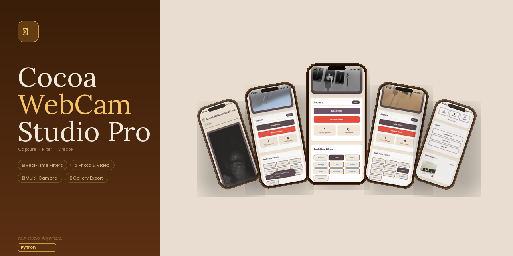
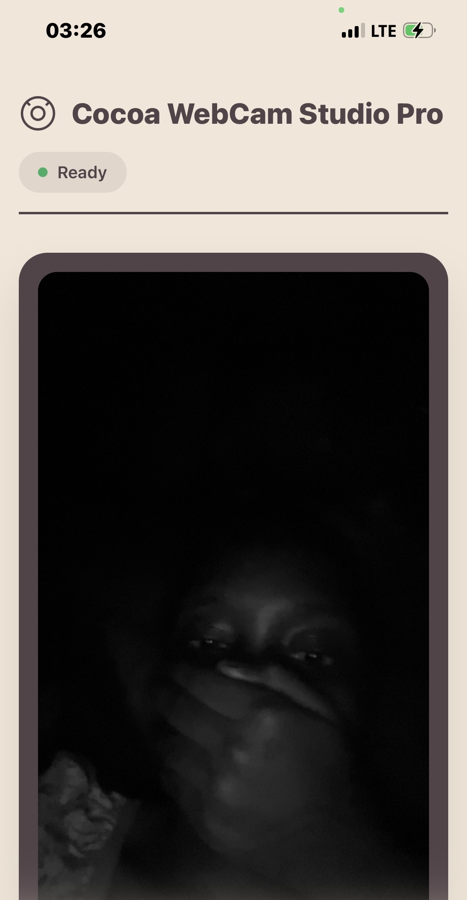
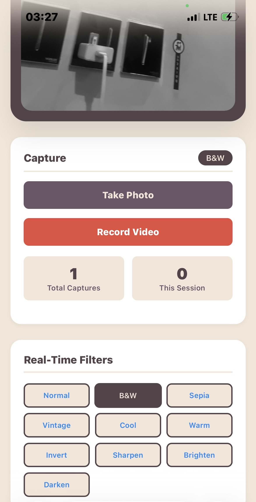
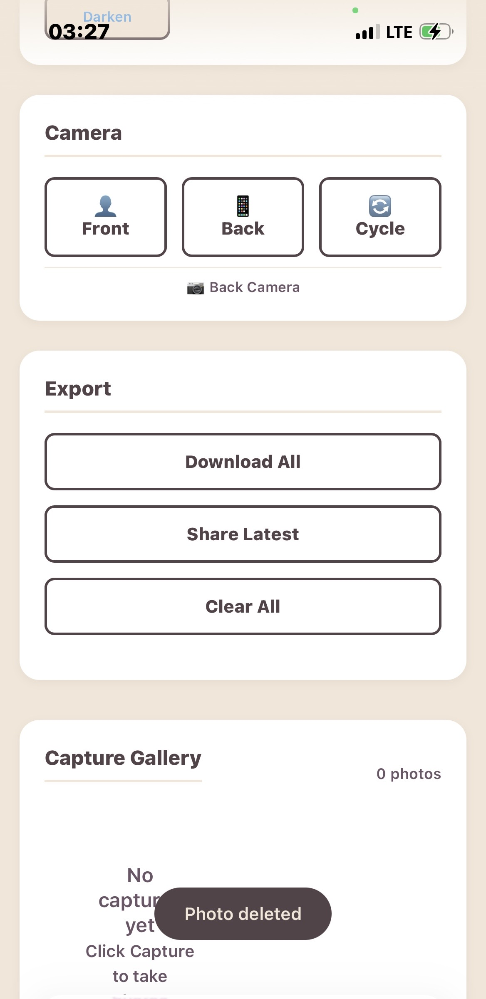
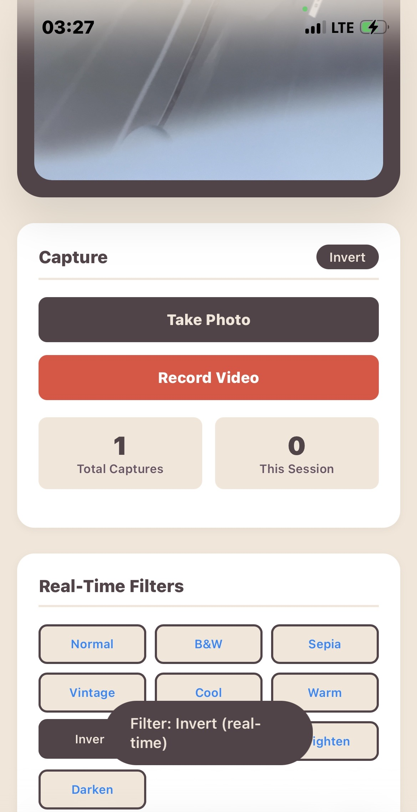

# Cocoa WebCam Studio

A professional webcam application that transforms how you capture and interact with your camera. Built with real-time filters, multi-camera support, and a focus on user experience.



## Overview

Cocoa WebCam Studio provides a complete camera solution with real-time visual effects. The application captures high-quality photos and videos while offering instant preview and organization tools. Built for creators, professionals, and anyone who wants more control over their webcam experience.



## Key Features

### Real-Time Visual Effects
Apply filters that update instantly as you move. Each effect processes pixel data in real-time without compromising performance.

- Black and white conversion with proper luminance weighting
- Classic sepia tone for vintage photography
- Warm and cool color temperature adjustments
- Invert colors for creative effects
- Brightness control with shadow and highlight preservation
- Edge detection and sharpening for enhanced detail



### Camera Management
Full control over your camera setup with intelligent device detection.

- Automatic detection of front and rear cameras
- Manual camera selection through interface controls
- Keyboard shortcuts for quick switching
- Real-time camera information display
- Seamless transition between multiple cameras

### Capture and Organization
Built-in gallery system that stores photos locally on your device.

- High-quality JPEG capture with adjustable compression
- Automatic timestamp and filter tracking
- Gallery grid view with quick preview
- Individual photo deletion and batch clearing
- Full-resolution export with original filter data



### Video Recording
Capture moments in motion with video recording capabilities.

- WebM format recording with VP9 codec
- Adjustable bitrate for quality control
- Visual recording indicator
- Automatic file naming with timestamps
- One-click download after recording

### Export and Sharing
Multiple ways to save and share your captures.

- Batch download of all photos as individual files
- Direct sharing through system share dialog
- Cross-platform sharing support for mobile devices
- Preserved metadata including filter information



### User Experience
Designed with attention to how people actually use camera applications.

- Keyboard shortcuts for power users:
  - Space: Capture photo
  - R: Start or stop recording
  - C: Cycle through cameras
  - F: Switch to front camera
  - B: Switch to back camera
  - Delete: Clear all captures
  - D: Download all photos
- Toast notifications for feedback
- Visual capture animation
- Responsive layout for mobile and desktop
- Dark overlay for focused viewing

## Technical Implementation

### Architecture
The application uses a single-file approach for simplified deployment while maintaining separation of concerns in the backend. The frontend handles all image processing and camera interactions, with the backend providing rate limiting and health monitoring.

### Security
- Rate limiting per IP address to prevent abuse
- Environment variables for configuration
- CORS protection for API endpoints
- Input validation for all user uploads

### Performance
- Request animation frame for smooth 60fps filter application
- Local storage for gallery persistence
- Image compression before storage
- Efficient pixel manipulation algorithms

## Installation

### Prerequisites
- Python 3.8 or higher
- Web browser with WebRTC support (Chrome, Firefox, Safari)

### Local Setup

1. Clone the repository:
```bash
git clone https://github.com/Aisha-Aliyu/Webcam.git
cd Webcam
```

1. Install dependencies:

```bash
pip install -r requirements.txt
```

1. Create environment file:

```bash
cp .env.example .env
```

1. Run the application:

```bash
python run_final.py
```

1. Open your browser to http://localhost:8000

Production Deployment

The application is configured for deployment on platforms like Render, Heroku, or PythonAnywhere. Environment variables should be set in the hosting platform's configuration panel.

API Endpoints

Endpoint Method Description
/ GET Main application interface
/health GET Health check and version information
/api/stats GET Application statistics and rate limit status

Configuration

Environment variables in .env:

```
SECRET_KEY=your-secure-key
API_RATE_LIMIT=100
RATE_LIMIT_WINDOW=3600
ALLOWED_ORIGINS=http://localhost:3000,http://localhost:8000
```

Browser Support

· Chrome 90 and above
· Firefox 88 and above
· Safari 14 and above
· Edge 90 and above

Mobile browsers with WebRTC support are fully supported including camera switching and sharing functionality.

Project Structure

```
cocoa-webcam-studio/
├── app/
│   └── main_day3_final.py    # Main application
├── screenshots/               # Application screenshots
├── requirements.txt           # Python dependencies
├── run_final.py              # Application entry point
├── .env                      # Environment configuration
└── README.md                 # Project documentation
```

Contributing

This project focuses on stability and user experience. Suggestions and feedback are welcome through GitHub issues.

License

MIT License - See LICENSE file for details.

Acknowledgments

Built with FastAPI for the backend and modern JavaScript for frontend interactions. The application uses Canvas API for image processing and MediaRecorder API for video capture.
